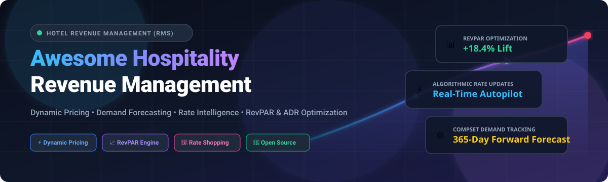

  

  
  
  
  
  
  
  

# 🏨 Awesome Hospitality Revenue Management 📈

> A curated directory of **Revenue Management Systems (RMS)**, **Dynamic Pricing Algorithms**, **Hotel Demand Forecasting Frameworks**, **Rate Shopping Tools**, and **Open-Source Hospitality Tech**.

---

## 📑 Table of Contents

- [🌐 Market Overview & Sector Dynamics](#-market-overview--sector-dynamics)
- [🏢 SaaS & Hosted Commercial Platforms](#-saas--hosted-commercial-platforms)
- [💻 Open-Source GitHub Projects & Analytics Engines](#-open-source-github-projects--analytics-engines)
- [🏗️ Architectural Frameworks for Custom RMS](#️-architectural-frameworks-for-custom-rms)
- [🤝 How to Contribute](#-how-to-contribute)
- [📊 Star History](#-star-history)
- [⚠️ Disclaimer](#️-disclaimer)

---

## 🌐 Market Overview & Sector Dynamics

> 💡 **Market Size & Industry Structure:** The global **Hospitality Revenue Management Software (RMS)** market is estimated at **$1.45 Billion in 2026** and projected to surpass **$2.85 Billion by 2032** (CAGR of ~11.5%). The sector exhibits a **moderately concentrated enterprise tier** (anchored by established enterprise systems like IDeaS, Infor, and Duetto for large chains and casino resorts) alongside a **rapidly growing, fragmented mid-market and independent tier** (driven by agile, autopilot AI pricing engines such as RoomPriceGenie, Atomize, FLYR, and BEONx), preventing a single winner-take-all monopoly and fueling continuous AI-driven price innovation.

---

## 🏢 SaaS & Hosted Commercial Platforms

Below is a comparison of commercial Hospitality Revenue Management Systems, sorted in descending order by **Company Scale / Valuation / Annual Revenue**:

| Platform | Scale / Valuation / Revenue | Description | Starting Price | Free Tier / Trial Limits |
| :--- | :--- | :--- | :--- | :--- |
| 👑 **[Infor EzRMS](https://www.infor.com/)** | **~$3.2B Revenue** (Parent: Koch Industries) | Enterprise revenue management software featuring demand forecasting and optimization algorithms integrated with the Infor Hospitality suite. | ~$950 / month (base tier for standard hotel deployments) | No free forever tier; tailored enterprise consultation and guided software demo on request (0 trial days). |
| 👑 **[IDeaS (SAS)](https://ideas.com/)** | **~$3.2B Revenue** (Parent: SAS Institute; ~$100M+ RMS division) | Enterprise-grade RMS (G3 RMS) providing demand forecasting, continuous automated pricing, and total RevPAR management for independent hotels and large chains. | ~$1,200 / month (base tier for independent and boutique properties) | No free forever tier; guided interactive demo and custom pilot evaluation on request (0 trial days). |
| 🦄 **[Lighthouse (OTA Insight)](https://www.lighthouse-hq.com/)** | **~$1.1B Valuation** (KKR/Spectrum Equity backed Unicorn; ~$100M+ ARR) | Market intelligence, rate-shopping, and pricing platform providing real-time competitor tracking and forward-looking demand signals. | $59 / month (entry-level Rate Insight tier; Pricing Manager tiers scale up) | Free trial upon request (typically 7–14 days customized compset access) + free Market Alerts tier with 90 days of market trend data. |
| 📈 **[RateGain](https://rategain.com/)** | **~$1.0B Market Cap** (NSE: RATEGAIN; ~$120M Annual Revenue) | Hospitality rate intelligence, real-time rate shopping (Navigator), distribution, and revenue optimization suite. | $25 / month (entry-level Navigator rate shopper tier; bundle plans ~$400/month) | 14-day free trial for Navigator rate shopper with competitive set tracking; demo available for enterprise RMS. |
| 🚀 **[Duetto](https://www.duetto.com/)** | **~$500M+ Valuation** (GrowthCurve Capital / Warburg Pincus; ~$45M ARR) | Cloud-native hospitality revenue platform known for Open Pricing, real-time dynamic decisioning, multi-property forecasting, and casino/upscale hotel optimization. | ~$1,000 / month (base tier depending on room count and property type) | No free forever tier; live personalized demo and customized product walkthrough available upon request (0 trial days). |
| ⚡ **[FLYR Hospitality (Pace)](https://www.pacerevenue.com/)** | **~$400M–$500M Valuation** ($225M+ raised; ~$35M ARR) | AI-driven revenue management and commercial intelligence engine offering continuous pricing recommendations and granular demand forecasting. | ~$700 / month (base platform tier; or ~€4.00–€13.00/room/month) | No free forever tier; custom platform walkthrough and revenue simulation upon request (0 trial days). |
| 🏨 **[Atomize](https://www.atomize.com/)** | **~$40M–$50M Valuation** (Part of SiteMinder, ASX: SDR ~$1.5B Cap; ~$8M ARR) | Real-time, AI-driven RMS specializing in automated dynamic rate setting with minimal manual intervention for independent and boutique hotels. | €299 / month (~$325 / month for entry-level tier / smaller properties) | No free forever tier; live interactive pilot and product demonstration upon request (0 trial days). |
| 🎯 **[BEONx](https://beonx.com/)** | **~$25M–$30M Valuation** (Series A/B venture-backed; ~$5M ARR) | Total revenue management and Hotel Quality Index (HQI) pricing platform focused on optimizing RevPAR, occupancy, and guest lifetime value. | ~$800 / month (base tier for mid-size properties) | No free forever tier; customized live proof-of-concept demonstration available upon request (0 trial days). |
| 🧞 **[RoomPriceGenie](https://www.roompricegenie.com/)** | **~$15M–$20M Valuation** (Series A venture-backed; ~$3M ARR) | Automated dynamic pricing platform built specifically for independent hotels, boutique properties, B&Bs, and serviced apartments. | $119 / month (Core plan, billed annually; $139/month billed monthly) | 14-day free trial with full platform access, complimentary onboarding, and no credit card required. |
| 🤖 **[Lybra Tech](https://www.lybra.tech/)** | **~$10M–$15M Valuation** (Acquired by Zucchetti Group, €2.0B Group Revenue) | AI-powered Assistant RMS delivering real-time demand collection, automated competitor rate tracking, and dynamic pricing suggestions. | $400 / month (base tier for single properties) | No free forever tier; 1-on-1 personalized live demonstration and revenue assessment upon request (0 trial days). |

---

## 💻 Open-Source GitHub Projects & Analytics Engines

Open-source building blocks for hotel property management, demand forecasting, rate shopping scrapers, dynamic pricing simulation, and revenue analytics, **sorted in descending order by GitHub Stars**:

| Project | Github_Stars | Category | Description |
| :--- | :--- | :--- | :--- |
| **[Apache Superset](https://github.com/apache/superset)** |  | BI & Analytics | Enterprise-ready data exploration and visualization platform ideal for hotel pace, pickup, RevPAR, and ADR dashboards. |
| **[Scrapy](https://github.com/scrapy/scrapy)** |  | Rate Intelligence | Fast, high-level web crawling and scraping framework used to build custom OTA and competitor rate-shopping engines. |
| **[ERPNext](https://github.com/frappe/erpnext)** |  | PMS & Operations | Complete open-source ERP system featuring hospitality and hotel management modules for room inventory and billing. |
| **[Prophet](https://github.com/facebook/prophet)** |  | Demand Forecasting | Tool for producing high quality forecasts for time series data that have strong seasonal effects and several seasons of historical hotel data. |
| **[Qlib](https://github.com/microsoft/qlib)** |  | Dynamic Pricing | AI-oriented quantitative investment and price optimization platform adaptable for dynamic pricing simulations. |
| **[Optuna](https://github.com/optuna/optuna)** |  | Optimization | Hyperparameter and price elasticity optimization framework to calibrate dynamic room pricing algorithms and bounds. |
| **[Statsmodels](https://github.com/statsmodels/statsmodels)** |  | Statistical Modeling | Python module that allows users to explore data, estimate statistical models, and perform econometric tests for hotel demand elasticity. |
| **[PyCaret](https://github.com/pycaret/pycaret)** |  | AutoML | Low-code machine learning library in Python that automates machine learning workflows for booking cancellation prediction and pace models. |
| **[AutoGluon](https://github.com/awslabs/autogluon)** |  | ML Forecasting | AutoML framework for tabular, time-series, and multimodal data with deep support for multi-horizon demand forecasting. |
| **[sktime](https://github.com/sktime/sktime)** |  | Time Series ML | Unified framework for machine learning with time series, providing algorithms for hotel occupancy regression and classification. |
| **[Darts](https://github.com/unit8co/darts)** |  | Forecasting Library | Python library for user-friendly forecasting and anomaly detection on time series, from ARIMA to deep learning models (N-BEATS, TiDE). |
| **[StatsForecast](https://github.com/Nixtla/statsforecast)** |  | Fast Forecasting | Lightning-fast forecasting algorithms (AutoARIMA, ETS, CES) optimized for processing thousands of room categories concurrently. |
| **[NeuralProphet](https://github.com/ourownstory/neural_prophet)** |  | Neural Forecasting | PyTorch-based neural time-series framework combining Prophet features with deep learning for hotel booking pace trends. |
| **[MarketStore](https://github.com/alpacahq/marketstore)** |  | Time Series DB | High-performance columnar time-series database designed for financial market data and rapid rate-shopping tick ingestion. |
| **[QloApps](https://github.com/Qloapps/QloApps)** |  | Hotel PMS Engine | Free and open-source customizable property management system and reservation engine providing underlying booking data for pricing engines. |

---

## 🏗️ Architectural Frameworks for Custom RMS

For independent operators and hospitality engineers engineering custom dynamic pricing pipelines:

1. **📊 Data Ingestion Layer:** Extract raw folio, booking pace, length of stay (LOS), and cancellation logs from PMS systems (e.g. QloApps, ERPNext, Opera, Mews APIs).
2. **🔎 Market & Compset Signal Engine:** Ingest flight search volume, local event calendars, weather feeds, and OTA competitor price feeds via tools like Scrapy.
3. **🤖 Predictive Modeling Core:** Run multi-horizon time-series models (via Darts, StatsForecast, or Prophet) to forecast unconstrained room demand across booking windows.
4. **⚙️ Optimization & Rule Engine:** Apply price elasticity curves, Min/Max rate guardrails, and stay restrictions (MLOS, CTA, CTD) using Optuna and custom rule solvers.
5. **🔄 Distribution Push:** Dispatch calculated Best Available Rates (BAR) back to channel managers and booking engines via real-time 2-way APIs.

---

## 🤝 How to Contribute

1. 🍴 Fork the repository.
2. 📝 Add or edit entries in `README.md` following the established table formats and SEO guidelines.
3. ✨ Include the platform/repo name, official link, scale/star metrics, pricing/trial terms, and a factual 1–2 sentence description.
4. 🚀 Submit a Pull Request with a descriptive summary of changes.

---

## 📊 Star History

---

## ⚠️ Disclaimer

- This is an **open community-curated directory** provided for research, educational, and benchmarking purposes.
- Hospitality revenue management decisions directly impact property RevPAR, GOPPAR, and consumer pricing fairness. Automated pricing models must be thoroughly backtested, monitored for compliance with consumer protection laws, and tuned to local market conditions.
- This repository is not financial or professional revenue management advisory.

---

  Curated with ❤️ for revenue managers, hoteliers, and hospitality technologists optimizing rate &amp; demand strategies worldwide.

